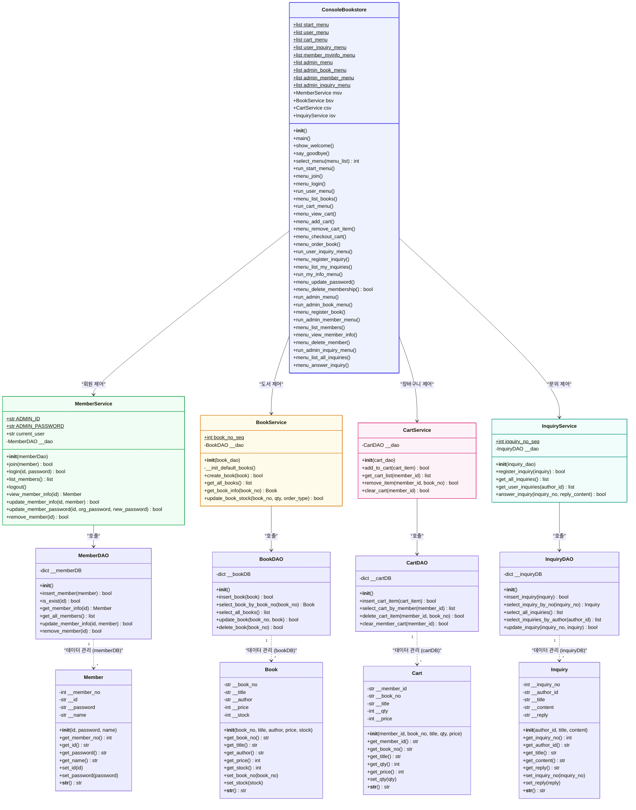

```mermaid
classDiagram
    direction TB

    %% ==========================================
    %% 1. CONTROLLER & CORE SYSTEM
    %% ==========================================
    class ConsoleBookstore {
        +list start_menu$
        +list user_menu$
        +list cart_menu$
        +list user_inquiry_menu$
        +list member_myinfo_menu$
        +list admin_menu$
        +list admin_book_menu$
        +list admin_member_menu$
        +list admin_inquiry_menu$
        +MemberService msv
        +BookService bsv
        +CartService csv
        +InquiryService isv
        +__init__()
        +main()
        +show_welcome()
        +say_goodbye()
        +select_menu(menu_list) int
        +run_start_menu()
        +menu_join()
        +menu_login()
        +run_user_menu()
        +menu_list_books()
        +run_cart_menu()
        +menu_view_cart()
        +menu_add_cart()
        +menu_remove_cart_item()
        +menu_checkout_cart()
        +menu_order_book()
        +run_user_inquiry_menu()
        +menu_register_inquiry()
        +menu_list_my_inquiries()
        +run_my_info_menu()
        +menu_update_password()
        +menu_delete_membership() bool
        +run_admin_menu()
        +run_admin_book_menu()
        +menu_register_book()
        +run_admin_member_menu()
        +menu_list_members()
        +menu_view_member_info()
        +menu_delete_member()
        +run_admin_inquiry_menu()
        +menu_list_all_inquiries()
        +menu_answer_inquiry()
    }

    %% ==========================================
    %% 2. MEMBER SUBSYSTEM
    %% ==========================================
    class Member {
        -int __member_no
        -str __id
        -str __password
        -str __name
        +__init__(id, password, name)
        +get_member_no() int
        +get_id() str
        +get_password() str
        +get_name() str
        +set_id(id)
        +set_password(password)
        +__str__() str
    }

    class MemberDAO {
        -dict __memberDB
        +__init__()
        +insert_member(member) bool
        +is_exist(id) bool
        +get_member_info(id) Member
        +get_all_members() list
        +update_member_info(id, member) bool
        +remove_member(id) bool
    }

    class MemberService {
        +str ADMIN_ID$
        +str ADMIN_PASSWORD$
        +str current_user
        -MemberDAO __dao
        +__init__(memberDao)
        +join(member) bool
        +login(id, password) bool
        +list_members() list
        +logout()
        +view_member_info(id) Member
        +update_member_info(id, member) bool
        +update_member_password(id, org_password, new_password) bool
        +remove_member(id) bool
    }

    %% ==========================================
    %% 3. BOOK SUBSYSTEM
    %% ==========================================
    class Book {
        -str __book_no
        -str __title
        -str __author
        -int __price
        -int __stock
        +__init__(book_no, title, author, price, stock)
        +get_book_no() str
        +get_title() str
        +get_author() str
        +get_price() int
        +get_stock() int
        +set_book_no(book_no)
        +set_stock(stock)
        +__str__() str
    }

    class BookDAO {
        -dict __bookDB
        +__init__()
        +insert_book(book) bool
        +select_book_by_book_no(book_no) Book
        +select_all_books() list
        +update_book(book_no, book) bool
        +delete_book(book_no) bool
    }

    class BookService {
        +int book_no_seq$
        -BookDAO __dao
        +__init__(book_dao)
        -__init_default_books()
        +create_book(book) bool
        +get_all_books() list
        +get_book_info(book_no) Book
        +update_book_stock(book_no, qty, order_type) bool
    }

    %% ==========================================
    %% 4. CART SUBSYSTEM
    %% ==========================================
    class Cart {
        -str __member_id
        -str __book_no
        -str __title
        -int __qty
        -int __price
        +__init__(member_id, book_no, title, qty, price)
        +get_member_id() str
        +get_book_no() str
        +get_title() str
        +get_qty() int
        +get_price() int
        +set_qty(qty)
        +__str__() str
    }

    class CartDAO {
        -dict __cartDB
        +__init__()
        +insert_cart_item(cart_item) bool
        +select_cart_by_member(member_id) list
        +delete_cart_item(member_id, book_no) bool
        +clear_member_cart(member_id) bool
    }

    class CartService {
        -CartDAO __dao
        +__init__(cart_dao)
        +add_to_cart(cart_item) bool
        +get_cart_list(member_id) list
        +remove_item(member_id, book_no) bool
        +clear_cart(member_id) bool
    }

    %% ==========================================
    %% 5. INQUIRY SUBSYSTEM
    %% ==========================================
    class Inquiry {
        -int __inquiry_no
        -str __author_id
        -str __title
        -str __content
        -str __reply
        +__init__(author_id, title, content)
        +get_inquiry_no() int
        +get_author_id() str
        +get_title() str
        +get_content() str
        +get_reply() str
        +set_inquiry_no(inquiry_no)
        +set_reply(reply)
        +__str__() str
    }

    class InquiryDAO {
        -dict __inquiryDB
        +__init__()
        +insert_inquiry(inquiry) bool
        +select_inquiry_by_no(inquiry_no) Inquiry
        +select_all_inquiries() list
        +select_inquiries_by_author(author_id) list
        +update_inquiry(inquiry_no, inquiry) bool
    }

    class InquiryService {
        +int inquiry_no_seq$
        -InquiryDAO __dao
        +__init__(inquiry_dao)
        +register_inquiry(inquiry) bool
        +get_all_inquiries() list
        +get_user_inquiries(author_id) list
        +answer_inquiry(inquiry_no, reply_content) bool
    }

    %% ==========================================
    %% SYSTEM RELATIONSHIPS (DEPENDENCY & USAGE)
    %% ==========================================
    ConsoleBookstore --> MemberService : "회원 제어"
    ConsoleBookstore --> BookService : "도서 제어"
    ConsoleBookstore --> CartService : "장바구니 제어"
    ConsoleBookstore --> InquiryService : "문의 제어"

    MemberService --> MemberDAO : "호출"
    BookService --> BookDAO : "호출"
    CartService --> CartDAO : "호출"
    InquiryService --> InquiryDAO : "호출"

    MemberDAO "1" ..> "*" Member : "데이터 관리 (memberDB)"
    BookDAO "1" ..> "*" Book : "데이터 관리 (bookDB)"
    CartDAO "1" ..> "*" Cart : "데이터 관리 (cartDB)"
    InquiryDAO "1" ..> "*" Inquiry : "데이터 관리 (inquiryDB)"

    %% ==========================================
    %% COLOR DESIGN STYLE
    %% ==========================================
    style ConsoleBookstore fill:#eef2ff,stroke:#4f46e5,stroke-width:2px
    style MemberService fill:#f0fdf4,stroke:#16a34a,stroke-width:1px
    style BookService fill:#fffbeb,stroke:#d97706,stroke-width:1px
    style CartService fill:#fdf2f8,stroke:#db2777,stroke-width:1px
    style InquiryService fill:#f0fdfa,stroke:#0d9488,stroke-width:1px
```
